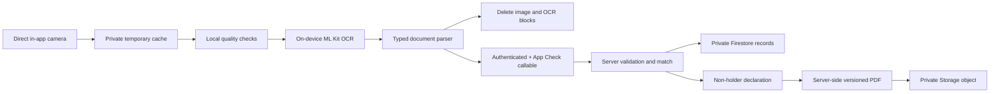

# Plaqa Verification V1

## Scope and assurance

This flow is a document-data and vehicle match, not an official document-authenticity check. Its stable security labels are:

```text
verificationMethod = on_device_ocr_front_v1
assuranceLevel = document_data_match
```

V1 supports the front of a German identity card, the data page of a passport, the front of a German electronic residence permit, and the front of a German registration certificate Part I. It does not perform selfie, face match, liveness, NFC, cloud OCR, external KYC, gallery upload, file upload, or backside processing.

## Architecture and data flow



The camera source is accepted only from the app's temporary area, adopted into `Directory.systemTemp/plaqa_verify_v1`, and deleted in a `finally` block even when read, decode, resize, or write fails. The managed copy is resized to at most 2400 pixels on its long edge, normalized for orientation, quality checked, and passed to on-device OCR. It is removed after success, error, retake, abort, logout, and startup orphan cleanup. Neither the image nor full OCR output is sent to Firebase.

## Processed and stored data

| Source | Runtime values | Persisted private values |
| --- | --- | --- |
| Identity front/data page | First names, last name, date of birth, expiry | The same four values, opaque identity version, document type, parser/privacy versions, method, assurance, status, timestamps |
| Registration front | A, C.1.1, C.1.2 | Normalized A, relation, `holderMatch`, matching opaque identity version, status, method, assurance, timestamps |
| Finger signature | Normalized vector points | No separate signature graphic or vectors |
| Declaration | Text and signature during generation | Version, text hash, PDF path/hash, acceptance time, relation, status |

C.1.1 and C.1.2 are submitted for one server-side comparison and are never written to Firestore, Storage, logs, analytics, or the PDF. Address, ID number, nationality, place of birth, VIN, HSN/TSN, model, raw MRZ, photo, and raw OCR text are neither extracted for the domain model nor persisted.

## Data model

```text
users/{uid}/private_verification/identity
users/{uid}/vehicle_verifications/{vehicleId}
users/{uid}/verification_declarations/{declarationId}
_verification_sessions/{sessionId}
_verification_rate_limits/{uid}
verification_declarations/{uid}/{vehicleId}/{declarationId}.pdf
```

Only the owner and an admin claim can read the three private user paths and PDF. Client writes are denied. Sessions and rate-limit records are invisible to clients. Admin SDK Functions perform every security-sensitive write.

## Backend contract

- `createVerificationSessionV1`: checks Auth, App Check, vehicle ownership, country, relation, and rate limits; returns a 15-minute nonce-bound session.
- `submitVerificationDataV1`: validates allowlisted fields, server date, minimum age, expiry, plate, and conservative names; stores only the permitted V1 snapshot.
- `finalizeVehicleDeclarationV1`: validates acceptance and meaningful bounded vector input; generates exactly one Unicode PDF with text and file hashes.
- `revokeOrInvalidateVerificationV1`: revokes status and declaration when authorization ends or the user requests it.
- `expireProfileVerificationV1`: hourly, paginated invalidation for expired identity documents and all dependent vehicles.

The Flutter client requests a limited-use App Check token for every V1 mutation. Callable exports enforce and consume that token, and the backend rejects an `alreadyConsumed` token before any read or write. Debug tokens are allowed only in debug builds. Release Android uses Play Integrity; Apple uses App Attest with DeviceCheck fallback.

`verification_v1_policy.js` is the authoritative backend policy for protected plate searches and contact requests. If a user already has a V1 identity record, an expired or otherwise ineffective V1 result always overrides stale public compatibility fields. The legacy compatibility fallback applies only while no V1 identity record exists and must be removed after the migration window. The former legacy submit callable remains exported only to return an App-Check-protected `update-required` response; it cannot create new legacy verification data.

## Relations and matching

The only accepted values are `registered_holder`, `leasing_vehicle`, `company_vehicle`, and `authorized_by_holder`. A registered holder needs exact normalized surname, a conservative first-name-token match, an exact normalized plate, a current identity document, and the configured Plaqa age of 16. Every other relation needs the same identity and plate checks plus declaration, checkbox, signature, and server finalization. No declaration can bypass a plate mismatch.

## Failure and recovery

The UI has explicit camera unavailable/denied, quality, missing or ambiguous OCR field, expired document, age, plate, holder, unsupported country, session, network, App Check, PDF, and retry states. Read values cannot be edited. An interrupted server submit reuses the nonce-bound session; changed replay data is rejected. Process restart never restores document images.

## Invalidation

- Identity name or date-of-birth changes rotate an opaque identity version. Every effective vehicle verification must match the current identity version, so a stale sibling becomes ineffective even if best-effort cleanup temporarily fails.
- Identity expiry invalidates all dependent vehicle records and declarations.
- Verification-relevant vehicle changes, including `sold`, `deregistered`, and `noLongerOwned`, invalidate its record and declaration. Only an active, owned, non-deleted vehicle can authorize a protected action.
- Vehicle removal revokes its record and declaration.
- Account deletion recursively removes private records, sessions, rate limits, legacy paths, and V1 PDFs.

Declaration finalization uses a short generation lease and a final compare-and-set transaction over the session, declaration, identity version, vehicle verification, active vehicle ownership, and account-deletion reservation. A concurrent revoke, status change, identity change, or account deletion aborts activation and removes the staged PDF.

Protected actions must use server-side effective status, not a cached UI Boolean. Expiry is valid through the date printed on the document and becomes expired on the following server day.

## Legacy migration

| Legacy | V1 handling |
| --- | --- |
| `verification_requests/{uid}` | Read-only during migration; no new client writes |
| `identityFront`, `identityBack` paths | No automatic conversion; report and separately clean after legal approval |
| `vehicleFront`, `vehicleBack` paths | No automatic conversion; C.1 values cannot be safely derived and retained |
| driver-licence paths | Unsupported and never migrated into V1 |
| manual identity expiry | Not trusted; V1 requires fresh camera/OCR |
| legacy verification Boolean | Kept for compatibility; never used to mint a V1 record |

Run the read-only inventory with application-default credentials:

```powershell
node tools/verification_v1_migration_report.js --project carma-a84e4
```

The script hashes user identifiers and never writes or deletes. Product owners must approve a separate cleanup date and retention/legal basis before deleting old objects. The release must set the minimum supported app version to the first V1 build because old clients can no longer write legacy drafts or photos.

Deprecated Storage prefixes to inventory separately:

```text
profile_documents/{uid}/identityFront/
profile_documents/{uid}/identityBack/
profile_documents/{uid}/vehicleFront/
profile_documents/{uid}/vehicleBack/
profile_documents/{uid}/driverLicenseFront/
profile_documents/{uid}/driverLicenseBack/
```

## Tests and release gates

Unit, widget, Functions, Firestore/Storage emulator, and synthetic integration tests cover parsing, normalization, quality, cleanup failures, four relations, privacy, signature, Auth/App Check replay, expiry, session replay, rate limits, PDF idempotency, concurrent revoke/deletion, identity-version drift, inactive vehicles, rules, account deletion, and invalidation. Real-device QA is specified in `docs/verification_v1_manual_qa.md`.

Before production deployment:

1. Deploy indexes, Firestore Rules, Storage Rules, and Functions together to a non-production Firebase project.
2. Register Android Play Integrity and Apple App Attest/DeviceCheck, observe App Check metrics, then enforce only after valid production traffic is confirmed.
3. Configure the minimum supported app version for the first V1 client.
4. Verify the scheduled expiry Function, Function region, IAM, Storage bucket, logs without PII, and budget alerts.
5. Enable Firestore TTL for `_verification_sessions.expiresAt`. TTL is cleanup only; every callable still validates session expiry itself.
6. Add GitHub `android-release` environment secrets described by the workflow. The workflow exposes them only to the signing-material step, removes the files before artifact upload, and pins every third-party action to a full commit SHA.
7. Complete legal review of privacy wording, declaration, retention, terms linkage, and controller/processor roles.
8. Build and test iOS on macOS/Xcode. Windows cannot establish this gate.

## Costs and residual risk

OCR and image processing are on-device and have no external per-check fee. Firebase costs are limited to a small number of callable invocations, private documents, scheduled scans, and non-holder PDFs. Billing must not be changed by automation.

App Check, OCR consistency, and a finger declaration do not prove that a photographed document is authentic or belongs physically to the user. A modified client or convincing forgery can submit plausible extracted values. V1 deliberately accepts this product boundary and must never be marketed as governmental, official, or high-assurance identity verification.
